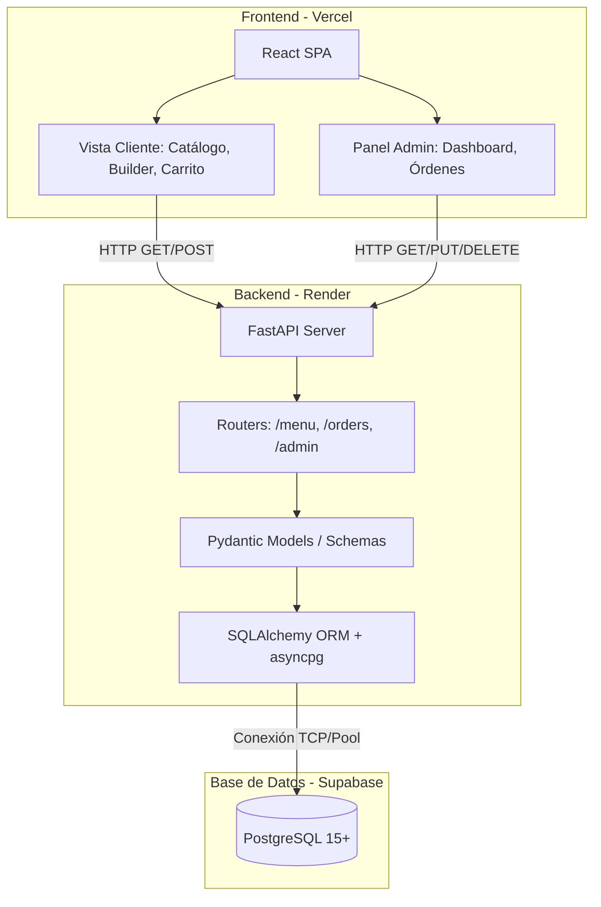

# 🍣 Guía Maestra de Arquitectura y Desarrollo: Sistema de Pedidos "DeliSushi"

Este documento es una especificación técnica detallada (Blueprint) diseñada para guiar a un agente de Inteligencia Artificial (o a un equipo de desarrollo) en la construcción de una plataforma de toma de pedidos para un restaurante de Sushi.

**Autor / Líder de Proyecto:** Sergio Lamos Lozano  
**Moneda de Referencia:** COP (Pesos Colombianos)

---

## 🚀 1. Stack Tecnológico Recomendado (El Stack "Melo" y 100% Gratuito)

Para lograr un sistema moderno, escalable, con excelente experiencia de desarrollador y **costo cero en infraestructura inicial**, se recomienda la siguiente arquitectura:

| Componente | Tecnología | Plataforma de Despliegue (Capa Gratuita) | Razón de la Elección |
| :--- | :--- | :--- | :--- |
| **Frontend (Cliente & Admin)** | React 18 + Vite + Tailwind CSS | **Vercel** | Vercel es insuperable para despliegues de React/Vite. Ofrece CI/CD automático desde GitHub, SSL gratis y CDN global. |
| **Backend (API REST)** | FastAPI (Python 3.11+) | **Render** | FastAPI es ultrarrápido y autogenera la documentación de la API (Swagger). Render ofrece un "Web Service" gratuito ideal para correr Python/Uvicorn. |
| **Base de Datos** | PostgreSQL (Relacional) | **Supabase** | Supabase ofrece una base de datos Postgres de hasta 500MB en su plan gratuito. Es robusta, segura y perfecta para la estructura relacional de opciones y variaciones. |

### Diagrama de Arquitectura


---

## 🗄️ 2. Diseño de Base de Datos (PostgreSQL en Supabase)

El modelo relacional está optimizado para la lógica de armado por pasos del Sushi. A nivel de FastAPI, se recomienda usar **SQLAlchemy 2.0 (Asíncrono)**.

### Tablas Principales

1. **`product_types`** (Módulos principales)
   * `id` (UUID, PK)
   * `name` (VARCHAR) -> Ej: "Sushi Rolls", "Woks", "Entradas"
   * `slug` (VARCHAR, UNIQUE) -> Ej: "sushi-rolls"
   * `emoji` (VARCHAR) -> "🍣"
   * `is_active` (BOOLEAN)

2. **`product_variations`** (Tamaños/Formatos)
   * `id` (UUID, PK)
   * `product_type_id` (UUID, FK)
   * `name` (VARCHAR) -> Ej: "Maki Entero (10 bocados)", "Medio Maki (5 bocados)"
   * `base_price` (INTEGER) -> Almacenado en COP (Ej: `28000`)

3. **`categories`** (Pasos del Builder)
   * `id` (UUID, PK)
   * `product_type_id` (UUID, FK)
   * `name` (VARCHAR) -> Ej: "1. Elige tu Proteína", "2. Salsas"
   * `is_required` (BOOLEAN)
   * `max_selections` (INTEGER)

4. **`options`** (Ingredientes)
   * `id` (UUID, PK)
   * `category_id` (UUID, FK)
   * `name` (VARCHAR) -> Ej: "Salmón", "Anguila", "Aguacate"
   * `extra_price` (INTEGER) -> Sobrecosto (Ej: `3000` COP) si es premium, `0` si está incluido.

5. **`orders`** (Cabecera del Pedido)
   * `id` (UUID, PK)
   * `customer_name` (VARCHAR)
   * `customer_phone` (VARCHAR)
   * `customer_address` (VARCHAR, NULL) -> Obligatorio si es domicilio.
   * `delivery_type` (VARCHAR) -> 'domicilio', 'recoger'
   * `delivery_cost` (INTEGER) -> Costo de envío (Ej: `4000` para envíos locales en Caicedonia).
   * `total_price` (INTEGER)
   * `status` (VARCHAR) -> 'pendiente', 'preparando', 'en_camino', 'entregado'
   * `created_at` (TIMESTAMP)

6. **`order_items`** & **`order_item_options`**
   * (Estructura estándar de líneas de factura y pivot de opciones seleccionadas).

---

## 🐍 3. Especificaciones para el Backend (FastAPI - Patrón MVC)

El agente de IA debe estructurar el proyecto backend siguiendo estrictamente el patrón **MVC (Modelo-Vista-Controlador)** para mantener el código organizado y escalable:

```text
backend/
├── app/
│   ├── main.py (Punto de entrada de FastAPI)
│   ├── core/ (Configuraciones, Base de datos, Variables de entorno)
│   ├── models/ (M - Modelos: Clases de SQLAlchemy para Supabase)
│   ├── views/ (V - Vistas: Rutas/Endpoints de FastAPI y esquemas Pydantic)
│   │   ├── schemas/ (Definición de datos de entrada/salida)
│   │   └── routes/ (menu.py, orders.py, admin.py)
│   └── controllers/ (C - Controladores: Lógica de negocio y consultas CRUD)
├── requirements.txt
└── .env
```

### Prompt sugerido para el Agente (Backend):
> *"Actúa como un desarrollador Senior de Python. Crea una API REST con FastAPI siguiendo estrictamente la arquitectura MVC (Model-View-Controller). Configura la conexión asíncrona a PostgreSQL (Supabase) usando SQLAlchemy 2.0. Crea la carpeta `models` para las tablas (types, variations, categories, options, orders). Crea la carpeta `controllers` para encapsular toda la lógica de negocio y CRUD. Crea la carpeta `views` que contenga los enrutadores (endpoints) y esquemas Pydantic. Necesito un endpoint `POST /orders` en `views/routes/orders.py` que llame a un controlador para calcular el total (base_price + extra_price) en el backend, agregue el costo de domicilio, y guarde el pedido en una transacción atómica."*

## ⚛️ 4. Especificaciones para el Frontend (React + Vite - Adaptación MVC)

El frontend debe ser un único proyecto estructurado con una mentalidad MVC adaptada a React:

```text
frontend/
├── src/
│   ├── models/ (Estado global e interfaces: Zustand store o Context API)
│   ├── views/ (Componentes visuales y páginas)
│   │   ├── client/ (Menu, ProductModal, SushiBuilder, Cart, Checkout)
│   │   ├── admin/ (Sidebar, OrderKanban, ProductManager)
│   │   └── pages/ (Home.jsx, AdminDashboard.jsx)
│   └── controllers/ (Lógica de llamadas a la API, custom hooks y validaciones)
│       └── services/ (Axios apuntando al backend)
```

### Reglas Clave para la Interfaz (Tailwind):
*   **Estética:** Diseño minimalista japonés-moderno. Fondos blancos/crema, acentos en rojo suave o naranja (salmón), y tipografía limpia (Inter o Roboto).
*   **Gestión del Carrito (Modelos):** Debe usar `Zustand` o `React Context` encapsulado en la capa de modelos. Cuando un usuario edita un Roll ya agregado, debe cargar sus opciones previas.
*   **Panel Admin (Vista Kanban):** El panel de control debe tener un tablero estilo Kanban.

### Prompt sugerido para el Agente (Frontend):
> *"Actúa como un desarrollador Frontend Experto. Crea un proyecto React con Vite y TailwindCSS organizando las carpetas bajo una filosofía MVC (models para estado, views para componentes UI, controllers para servicios HTTP y hooks de lógica). Construye la vista del cliente para un restaurante de Sushi con un componente 'Builder' dinámico. Crea una ruta `/admin` que renderice un Dashboard para ver los pedidos entrantes llamando a los controladores que hacen polling a la API."*

## 🚀 5. Flujo de Despliegue (Guía Paso a Paso)

1.  **Supabase:**
    *   Crea un nuevo proyecto en Supabase.
    *   Ve a *Settings > Database* y copia la cadena de conexión (Connection String - URI).
2.  **Backend (Render):**
    *   Sube el código de FastAPI a un repositorio de GitHub.
    *   Crea un nuevo "Web Service" en Render conectando ese repositorio.
    *   Configura el *Build Command*: `pip install -r requirements.txt`
    *   Configura el *Start Command*: `uvicorn app.main:app --host 0.0.0.0 --port 10000`
    *   Añade la variable de entorno `DATABASE_URL` pegando la URI de Supabase.
3.  **Frontend (Vercel):**
    *   Sube el código de React a GitHub.
    *   Importa el proyecto en Vercel. Framework preset: Vite.
    *   Añade la variable de entorno `VITE_API_URL` con la URL pública que te generó Render (ej. `https://delisushi-api.onrender.com`).
